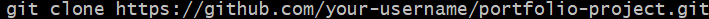
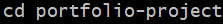

# Table of Contents

1. [Contributing Guidelines](#contributing-guidelines)
2. [License](#license)

## Contributing Guidelines

1. Clone the repository to your local machine:

   

2. Navigate to the project directory:

   

3. Create a new branch (feature/new-feature).

4. Make your changes.

5. Commit your changes (git commit -m 'Add new feature').

6. Push to the branch (git push origin feature/new-feature).

7. Open a Pull Request.

## License

This project is licensed under the MIT License. See the [LICENSE](LICENSE.md) file for more details.
