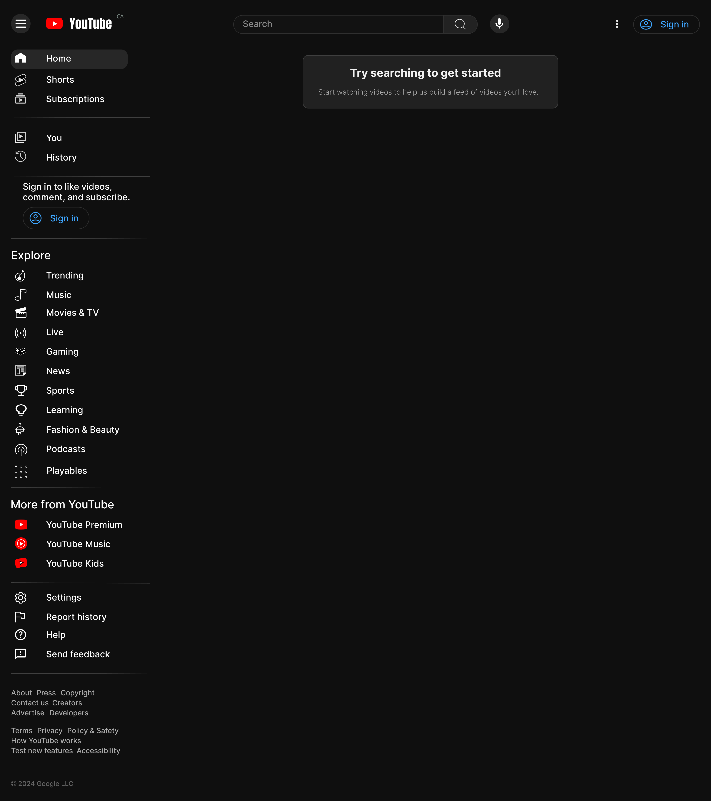

# Projects

## Here are the projects that I've done so far in this program

Web Page Reconstruction for [YouTube](https://www.youtube.com/) using Figma. We were tasked to choose a website or an app and recreate its homepage using Figma. I chose YouTube because I watch videos on YouTube a lot of times and I thought it would be fun to recreate the icons in the navigation bar.

[Mood Board](https://www.figma.com/design/A5ONXtg85XYFvgtlOJZfAN/Book-Review-Mood-Board?node-id=0-1&t=uFwWEs0CUDCoISkm-1) for my Book Review Website using Figma. A mood board is a visual collage or collection of images, textures, colors, typography, and other design elements that convey a specific style, theme, or concept. It serves as a creative tool to inspire and guide a project, helping to communicate ideas and set the overall tone. We were tasked to create a mood board for our personal webpage and I've decided on Book Review Website because I love reading books.

